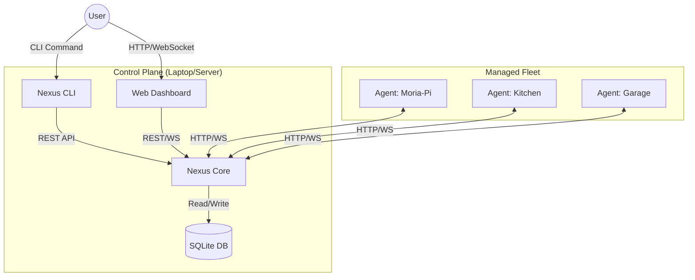
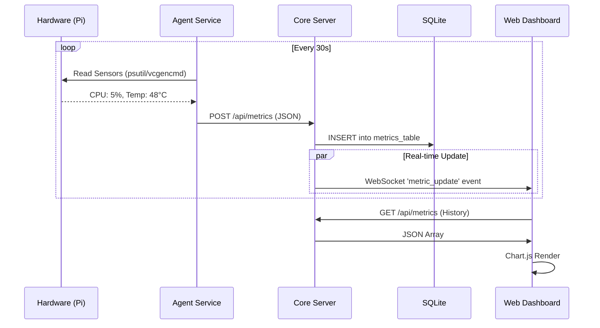
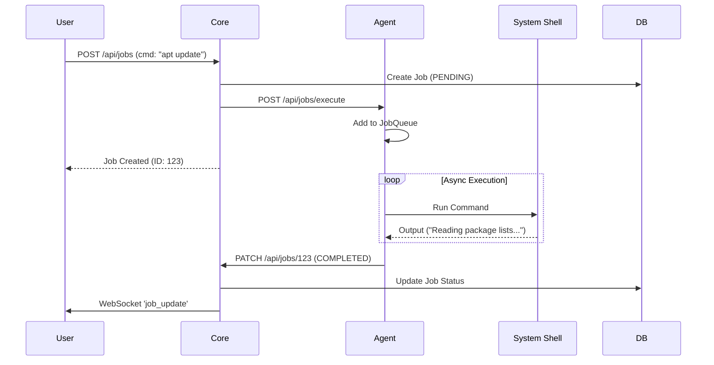

# Nexus System Architecture 🏗️

> **The System Map**: A technical overview of how Nexus components fit together.

## 1. High-Level Topology

Nexus follows a **Hub-and-Spoke** architecture. The **Core** server acts as the central command post, while **Agents** run on managed nodes (Raspberry Pis, servers) to execute tasks and report data.

---

## 2. Component Map

### 🧠 Nexus Core (`nexus/core/`)
The brain of the operation. Handles API requests, database storage, and fleet orchestration.
- **`main.py`**: Entry point. Sets up FastAPI, static files, and database connection.
- **`api/`**: REST endpoints for the Dashboard and Agents.
    - `nodes.py`: Node registration & management.
    - `metrics.py`: Metrics ingestion & history.
    - `jobs.py`: Job submission & status tracking.
- **`services/`**: Background logic.
    - `health.py`: Calculates node health status.
    - `logs.py`: Manages centralized logging.
- **`db/`**: SQLAlchemy models (`models.py`) and database access.

### 🤖 Nexus Agent (`nexus/agent/`)
The hands and eyes. Runs on every managed node.
- **`main.py`**: Entry point. Auto-registers with Core on startup.
- **`services/`**:
    - `metrics.py`: Collects system stats (CPU, Mem, Disk, Temp) every 30s. Uses `psutil` & `vcgencmd`.
    - `job_queue.py`: FIFO queue for executing tasks (shell commands, etc.).
    - `log_collector.py`: Buffers and sends logs to Core.
- **`api/`**: Local control endpoints (used by Core to command the Agent).

### 🖥️ Web Interface (`nexus/web/`)
The "Single Pane of Glass".
- **`templates/`**: Jinja2 HTML templates (`dashboard.html`, `nodes.html`).
- **`static/css/styles.css`**: Tailwind CSS + Custom "Cyber" theme styles.
- **`static/js/nexus-ui.js`**: **(Refactored)** Central page controller. Handles WebSocket connections and auto-refresh logic.
- **`static/js/nexus-charts.js`**: **(Refactored)** Centralized Chart.js configuration and multi-series update logic.

---

## 3. Data Flows

### 📊 Metric Pipeline (The "Pulse")
How data gets from a Raspberry Pi CPU to your browser chart.

### ⚡ Control Flow (The "Hands")
How a job (e.g., "Run Update") is executed.

---

## 4. Key Configurations
- **Database**: `nexus.db` (SQLite) in `data/` directory.
- **Logs**: `nexus.log` in `logs/` directory.
- **Config**: Environment variables in `.env` (Source of Truth).
    - `NEXUS_CORE_URL`: Where Agents look for the Core.
    - `NEXUS_SHARED_SECRET`: Password for new Agents to join.
