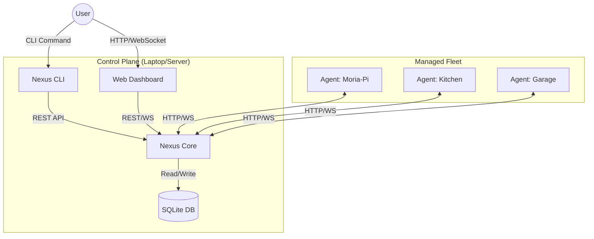
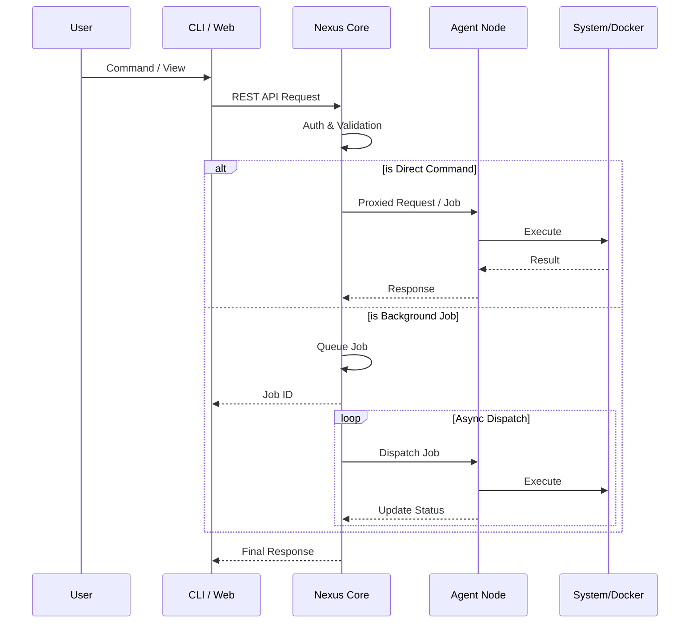
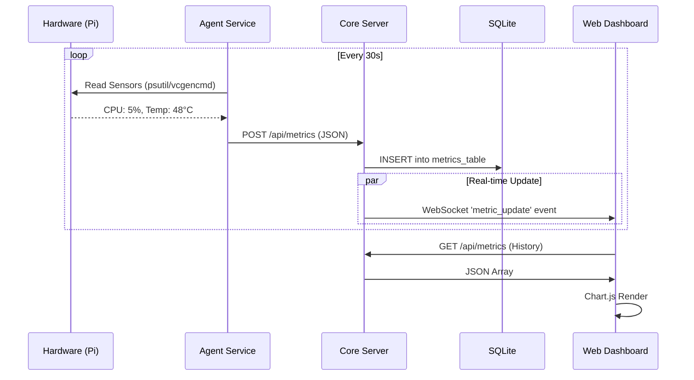
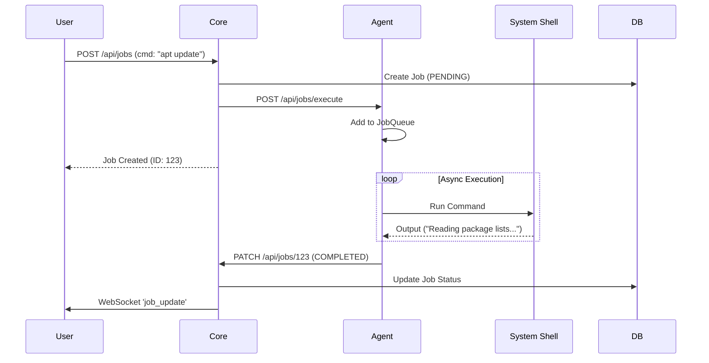

# Nexus Architecture

## Overview

Nexus is a distributed fleet orchestration platform for Debian-based machines, built with a **CLI-first** and **Docker-first** philosophy. The architecture consists of two main components: **Core** (control plane) and **Agent** (data plane), with Docker serving as the primary mechanism for deploying and managing services across the fleet.

**Supported Systems:** Raspberry Pi OS, Ubuntu, Debian, and any Debian-derivative Linux distribution.

## High-Level Topology

Nexus follows a **Hub-and-Spoke** architecture. The **Core** server acts as the central command post, while **Agents** run on managed nodes to execute tasks and report data.



---

## Components

### Core (Control Plane)

The Core is the central management server that orchestrates the fleet.

**Responsibilities:**
- Node registration and authentication
- Job scheduling and distribution
- Metrics aggregation and storage
- Web dashboard (optional)
- CLI command execution

**Technology:**
- FastAPI for REST API and WebSocket endpoints
- SQLite for persistent storage
- Typer for CLI
- **Location:** `nexus/core/`

**Deployment:**
- Runs on a central server (can be a Raspberry Pi or any Linux machine)
- Accessible via local network or VPN

### Agent (Data Plane)

The Agent runs on each managed node (Raspberry Pi, Ubuntu server, Debian machine, etc.).

**Responsibilities:**
- Register with Core on startup
- Execute jobs assigned by Core (shell commands, Docker operations)
- Collect and report system metrics (CPU, RAM, disk, temperature)
- Manage Docker containers and services
- Provide remote shell access (WebSocket-based)
- Monitor Docker container health and resource usage

**Technology:**
- FastAPI for agent API
- psutil for system metrics (cross-platform)
- Docker SDK for Python for container management
- Platform-specific monitoring (vcgencmd for Pi, lm-sensors for others)
- **Location:** `nexus/agent/`

**Deployment:**
- Runs as a systemd service on each node
- Python virtual environment for isolation
- Dockerized deployment optional (for Core compatibility)

### Web Interface

The "Single Pane of Glass" for visualization.

- **Location:** `nexus/web/`
- **Stack:** Jinja2 templates, Tailwind CSS, Vanilla JS + Alpine.js
- **Features:** Real-time Chart.js metrics, CLI view, Node management

---

## Communication Flow



---

## Authentication & Security

### Registration Flow

1. Agent starts with pre-configured **shared secret**
2. Agent sends registration request to Core (`POST /api/register`)
3. Core validates shared secret
4. Core issues unique **API token** to Agent
5. Agent stores token and uses for all future requests

### Request Authentication

- All API requests use Bearer token authentication
- Tokens are JWT-based with expiration
- Core validates tokens on each request

### Transport Security

- **Local Network:** TLS/HTTPS with self-signed or Let's Encrypt certs
- **Remote Access:** VPN layer (ZeroTier/Tailscale) provides encrypted tunnel

---

## Data Model

### Node

Represents a managed Raspberry Pi.

```python
{
    "id": "uuid",
    "name": "kitchen-pi",
    "ip_address": "192.168.1.100",
    "status": "online|offline|error",
    "last_seen": "timestamp",
    "metadata": {
        "location": "kitchen",
        "tags": ["camera", "ocr"]
    }
}
```

### Job

Represents a task to be executed on a node.

```python
{
    "id": "uuid",
    "type": "ocr|shell|sync",
    "node_id": "uuid",
    "status": "pending|running|completed|failed",
    "payload": {...},
    "created_at": "timestamp",
    "completed_at": "timestamp"
}
```

### Metric

System health metrics from a node.

```python
{
    "node_id": "uuid",
    "timestamp": "timestamp",
    "cpu_percent": 45.2,
    "memory_percent": 62.1,
    "disk_percent": 38.5,
    "temperature": 52.3
}
```

---

## Modules

### Speculum (Metrics Collection)

**Core Functionality:**
- Runs on Agent
- Collects CPU, RAM, disk, temperature every 30s
- Pushes metrics to Core via `POST /api/metrics`
- Core stores in SQLite for historical analysis

**Metric Pipeline Diagram:**



**Multi-Disk Detection (Phase 6.5.1):**
Nexus automatically detects and categorizes all storage devices on each node (HDD, SSD, NVMe, SD Card, USB).

### Imperium (Remote Terminal & Control)

**Control Flow Diagram:**



- WebSocket-based remote shell
- User initiates from CLI: `nexus node shell <node_id>`
- Core proxies WebSocket to Agent

### Scriptor (OCR Engine)
- Processes images submitted as jobs using Tesseract
- Outputs Markdown files

### Arbiter (Sync Conflict Resolver)
- Monitors Syncthing conflict files and reports to Core

---

## Docker Service Orchestration

Nexus uses Docker as the foundational technology for deploying and managing services across the fleet.

### Architecture

```
┌──────────────────────────────────────────┐
│           Nexus Core                     │
│  ┌────────────────┐  ┌────────────────┐ │
│  │ Services API   │  │ Deployments    │ │
│  │ (Templates)    │  │ API            │ │
│  └────────┬───────┘  └────────┬───────┘ │
└───────────┼──────────────────┼─────────┘
            │                  │
            │ REST API         │ REST API
            │                  │
            v                  v
┌─────────────────────────────────────────┐
│         Agent Node (Phase 7.2+)         │
│  ┌───────────────┐                      │
│  │ Docker SDK    │                      │
│  │ Integration   │                      │
│  └───────┬───────┘                      │
│          │                              │
│  ┌───────v────────┐                     │
│  │ Docker Daemon  │                     │
│  └───────┬────────┘                     │
│          │                              │
│  ┌───────v──────┐  ┌──────────┐        │
│  │ Container 1  │  │Container2│        │
│  │  (Pi-hole)   │  │(Grafana) │        │
│  └──────────────┘  └──────────┘        │
└─────────────────────────────────────────┘
```

### Core API & Agent Integration

**Service Templates Management:**
- `POST /api/services` - Create service template
- Supports standard Docker Compose YAML

**Deployment Management:**
- `POST /api/deployments` - Create deployment
- `POST /api/deployments/{id}/start` - Start deployment
- Agent uses Docker SDK for Python to interact with local Docker daemon

---

## Network Topology

### Local Network (Default)

```
┌──────────────────────────────────┐
│      Local Network (LAN)         │
│                                  │
│  ┌──────┐    ┌──────┐  ┌──────┐ │
│  │ Core │────│Agent1│──│Agent2│ │
│  └──────┘    └──────┘  └──────┘ │
│                                  │
└──────────────────────────────────┘
```

- Core listens on `0.0.0.0:8000`
- Agents discover Core via configuration or mDNS

### Remote Access (Optional)

Using ZeroTier/Tailscale/VPN:

```
┌────────────────────────────────────┐
│    Internet                        │
│                                    │
│  ┌──────┐    VPN Mesh    ┌──────┐ │
│  │ Core │◄──(ZeroTier)──►│Agent │ │
│  └──────┘                └──────┘ │
│                                    │
└────────────────────────────────────┘
```

---

## Deployment

### Development

```bash
# Run Core locally
uvicorn nexus.core.main:app --reload

# Run Agent locally
uvicorn nexus.agent.main:app --port 8001 --reload
```

### Production

**Core:**
```bash
docker-compose up -d nexus-core
```

**Agent (on each Pi):**
```bash
docker-compose up -d nexus-agent
```
Or use systemd service.

---

## Scaling Considerations

### Core Scalability
- **SQLite Limits:** Good for ~100-500 nodes with moderate traffic
- **Migration Path:** If fleet grows, migrate to PostgreSQL
- **Horizontal Scaling:** Add Redis for job queue

### Agent Efficiency
- Lightweight metrics collection (minimal CPU/RAM)
- Graceful degradation when Core unreachable

---

## Future Enhancements

### Near-term (Phase 7.2-7.3)
- **Agent Docker Module:** Docker SDK integration on agents for actual container execution
- **Pre-built Service Templates:** Ready-to-deploy configurations

### Long-term
- **Service Discovery:** Implement mDNS for zero-config setup
- **HA Core:** Multiple Core replicas
- **Edge Intelligence:** Agents can execute jobs locally when Core is offline
