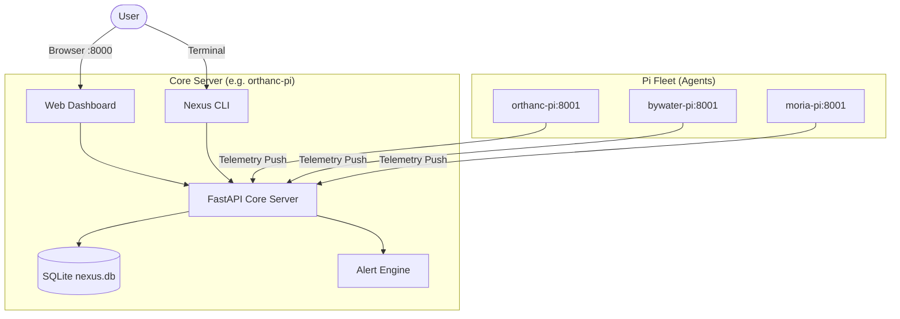

# Nexus 🌐

**Lightweight Raspberry Pi Fleet Observability & Telemetry**

> *Real-time metrics, hardware health, and container visibility across your Pi fleet — without the bloat of full RMM or complex orchestration.*

Nexus is a focused, lightweight observability platform built specifically for home lab Raspberry Pi fleets. It provides immediate visibility into host hardware health (CPU, RAM, multi-disk storage, temperatures, and failing SD card detection) and running Docker containers, accessible via both a fast terminal CLI and a real-time web dashboard.

---

## 🎯 Core Philosophy & Scope Lock

* **Observability-First:** Real-time metrics (CPU, RAM, storage, temperatures) collected every 30s.
* **Hardware-Aware:** Automatically classifies storage (NVMe vs SSD vs MicroSD) and actively flags read-only filesystem faults caused by failing SD cards.
* **Container Visibility:** Read-only inspection of running Docker containers across nodes (uptime, image versions, port mappings, and status).
* **CLI & Web Dashboard:** Instant terminal queries (`nexus node list`, `nexus metrics get`) paired with a modern "Single Pane of Glass" glassmorphism dashboard.
* **Strict Anti-Creep:** No full RMM, no bespoke OTA package patchers, and no heavyweight container orchestration engines. Just clear, reliable telemetry.

---

## 🏗️ Architecture

Nexus follows a lightweight **Hub-and-Spoke** telemetry model:



* **Core Server (`nexus-core`):** Central FastAPI service holding time-series metrics, node registrations, container inventories, and active alert thresholds in SQLite.
* **Agent Node (`nexus-agent`):** Lightweight background daemon running on each Pi, gathering hardware sensors (`psutil`, `vcgencmd`, disk mounts) and Docker daemon state.

---

## ✨ Key Capabilities

### 1. Fleet Telemetry & Observability
* **Live System Metrics:** CPU %, RAM %, Disk %, and GPU/CPU temperatures refreshed every 30 seconds.
* **Multi-Disk Classification:** Detects NVMe drives, external USB SSDs/HDDs, and internal MicroSD cards.
* **SD Card Failure Detection:** Actively detects when physical flash errors cause Linux to remount the root filesystem as `read-only`.
* **Historical Trends:** Interactive time-series charts (30m, 1h, 6h, 24h) with automated 7-day data retention.

### 2. Container Visibility
* Real-time inventory of all running Docker containers per node.
* Detailed container inspection: container IDs, image tags, port mappings, and uptime.
* Quick diagnostic visibility to ensure critical homelab containers (Pi-hole, Jellyfin, Home Assistant) are alive.

### 3. Proactive Alerting
* Automated evaluation of fleet health against critical thresholds:
  * **High CPU:** > 95%
  * **Memory Exhaustion:** > 95%
  * **Storage Exhaustion:** > 95%
  * **Pi Overheating:** > 85°C (warning at > 75°C)
  * **Node Offline:** Heartbeat timeout after missed reporting cycles.
  * **Read-Only Storage:** Instant alert if an SD card locks into read-only mode.

---

## ⚡ Quick Start

### 1. Running the Core Server

```bash
cd /home/methinked/Projects/nexus/nexus
source venv/bin/activate

# Start Nexus Core on port 8000
python -m nexus.core.main
```
Visit `http://<core_ip>:8000` to open the Web Dashboard.

### 2. Running the Agent on a Pi

```bash
cd /home/methinked/nexus-agent
source venv/bin/activate

# Start Nexus Agent on port 8001
python -m nexus.agent.main
```

---

## 📖 CLI Usage

Control and query your fleet directly from your terminal:

```bash
# List all registered nodes and their connectivity status
nexus node list

# Inspect detailed telemetry and hardware metadata for a node
nexus node status <node_id>

# View recent metrics and averages
nexus metrics get <node_id>
nexus metrics stats <node_id>

# Query node health evaluation against thresholds
nexus metrics health <node_id>

# View centralized log streams
nexus logs list
```

---

## 🔒 Security & Networking

* **LAN & VPN Native:** Operates seamlessly across local subnets or encrypted overlays (Tailscale / ZeroTier).
* **Token Authentication:** Secure JWT-based handshake between agents and the core server.
* **Minimal Privileges:** Agent queries read-only system metrics and Docker sockets without opening arbitrary remote code execution backdoors.
