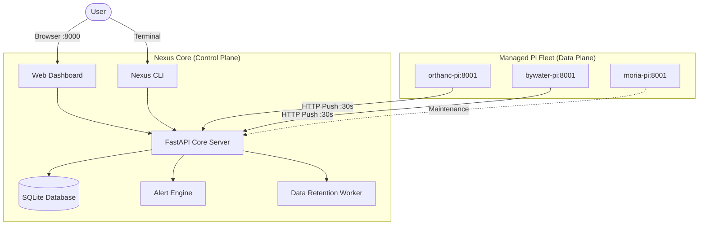

# Nexus System Architecture

## 1. Overview & Purpose

Nexus is a focused, lightweight observability and telemetry system for Raspberry Pi homelab fleets. It provides real-time hardware health metrics, storage failure warnings (including MicroSD read-only states), container visibility, and proactive alerting without the overhead or security footprint of full RMM or custom container orchestrators.

---

## 2. High-Level Architecture

Nexus utilizes a clean **Hub-and-Spoke** telemetry architecture:

---

## 3. Core System Components

### 3.1 Nexus Core Server (`nexus.core`)
* **Framework:** FastAPI (Python 3.11+) with Uvicorn.
* **Database:** SQLite with SQLAlchemy 2.0 and Alembic migrations.
* **Telemetry Receiver:** Ingests metric payloads (CPU, RAM, Disk, Temperature) and container inventory every 30s.
* **Alert Engine:** Continuously evaluates node status, heartbeats, and resource thresholds (e.g. CPU > 95%, Disk > 95%, Temp > 85°C, or Read-Only SD card flag).
* **Data Retention:** Automated background task trimming historical metrics older than 7 days.
* **Dashboard Engine:** Server-side rendered Jinja2 templates styled with Tailwind CSS and Chart.js.

### 3.2 Nexus Agent (`nexus.agent`)
* **Lightweight Daemon:** Runs on each managed Pi node as a systemd service (`nexus-agent.service`).
* **Sensors & Collectors:**
  * `psutil`: CPU utilization, memory pressure, and mountpoint disk stats.
  * `vcgencmd`: Native Broadcom SoC / GPU temperature readings on Raspberry Pi OS.
  * Storage Classifier: Inspects block devices (`/sys/block`) to distinguish NVMe, SSD, and MicroSD storage.
  * Degraded Storage Flag: Flags when a filesystem is remounted `read-only` due to flash block wear.
  * Docker Socket: Inspects local container status, exposed ports, and image tags.
* **Registration & Heartbeat:** Handshakes with Core using a pre-shared token and sends heartbeat pings with telemetry payloads.

### 3.3 Nexus CLI (`nexus.cli`)
* Built with `Typer` and `Rich` for fast terminal inspection:
  * `nexus node list`: Fleet overview with status and IPs.
  * `nexus node status <id>`: Deep hardware and storage breakdown.
  * `nexus metrics get <id>`: Current sensor readings.
  * `nexus metrics stats <id>`: 24-hour min/max/average statistics.
  * `nexus logs list`: Centralized log viewer.

---

## 4. Anti-Creep Boundary (What is Excluded)

* **No Remote Terminal / Shell Backdoor:** Nodes are managed via standard SSH and keys. Nexus does not implement interactive PTY bridges.
* **No Bespoke OTA Patch Management:** OS updates are handled via standard package management (`apt`), not binary agent pushers.
* **No Custom Container Orchestration:** Docker Compose files on each node are the source of truth. Nexus inspects container health but does not attempt to replicate Kubernetes or Portainer.
